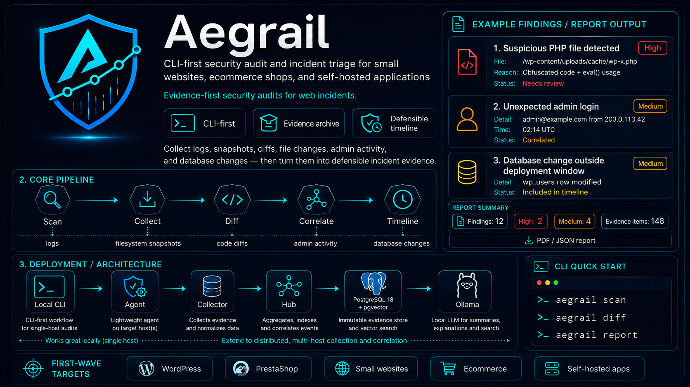

# Aegrail

Aegrail is a CLI-first security audit and incident triage tool for small websites, ecommerce shops, and self-hosted applications. The original product sketch is preserved in `idea.md`; new implementation work uses `aegrail` as the product and binary name.



## Current Documents

- [Architecture](docs/architecture.md): module boundaries, runtime pipeline, storage strategy, and Ollama integration.
- [Distributed Architecture](docs/distributed-architecture.md): Agent, DB Collector, Hub, inventory, and cross-host correlation model.
- [Implementation Plan](docs/implementation-plan.md): phased delivery plan from repository foundation to reports.
- [Pantheon WordPress Monitoring Plan](docs/platforms/pantheon-wordpress.md): planned support for Pantheon-hosted single WordPress and WordPress Multisite networks.
- [Browser Crawler And JavaScript Monitoring Plan](docs/collectors/browser-crawler.md): static and rendered-page crawler direction for script inventory, tag managers, and JavaScript drift.
- [Tracker](docs/tracker.md): living task board for MVP work.
- [Architecture Decision 0001](docs/decisions/0001-modular-monolith.md): why the first implementation should be a modular monolith.
- [Architecture Decision 0002](docs/decisions/0002-aegrail-binary-name.md): why the binary is named `aegrail`.
- [Architecture Decision 0003](docs/decisions/0003-local-postgres18-pgvector.md): local PostgreSQL 18 and pgvector service choice.
- [Architecture Decision 0004](docs/decisions/0004-pgx-and-goose.md): PostgreSQL driver and migration tool choice.
- [Architecture Decision 0005](docs/decisions/0005-local-evidence-archive.md): local immutable evidence archive choice.
- [Architecture Decision 0006](docs/decisions/0006-first-wave-target-modules.md): WordPress and PrestaShop first-wave target choice.
- [Architecture Decision 0007](docs/decisions/0007-agent-hub-architecture.md): Agent plus Hub distributed architecture.
- [Architecture Decision 0008](docs/decisions/0008-one-repo-multiple-runtime-apps.md): one repo structured as Local, Hub, Agent, and Collector apps.
- [Brand Assets](docs/brand/README.md): existing visual identity and generated brand files.
- [Services](services/README.md): local Docker services for development.

## Quick Start

```powershell
cd app
go run ./cmd/aegrail --help
go run ./cmd/aegrail init --data-dir ../data
```

Runtime app groups:

```powershell
go run ./cmd/aegrail hub --help
go run ./cmd/aegrail agent --help
go run ./cmd/aegrail collector --help
go run ./cmd/aegrail collector browser crawl --url https://example.com --format json
go run ./cmd/aegrail collector browser crawl --url https://example.com --rendered --wait-tag-manager --timeout 30s --format json
go run ./cmd/aegrail collector browser crawl --url https://example.com --rendered --ingest --org acme --project customer-site --env production --app main-web --service frontend --host web-01 --agent-id agt_web_01
go run ./cmd/aegrail hub correlate browser-scripts --org acme --project customer-site --env production --app main-web --baseline 30d --since 24h --save
go run ./cmd/aegrail hub browser-scripts allow --org acme --project customer-site --env production --app main-web --page https://example.com --kind domain --value trusted-chat.example --reason "approved chat vendor"
```

Start local infrastructure:

```powershell
docker compose -f services/compose.yaml up -d postgres18
```

Apply migrations and create a site:

```powershell
cd app
go run ./cmd/aegrail db migrate
go run ./cmd/aegrail site add --name "Petlink Demo" --url https://petlink.example petlink
go run ./cmd/aegrail site list
$env:AEGRAIL_DATA_DIR="../data"
go run ./cmd/aegrail import logs --site petlink --path testdata/evidence-sample
```

Create a distributed Hub inventory path:

```powershell
cd app
go run ./cmd/aegrail inventory bootstrap single-site --kind wordpress --org acme --org-name "Acme" --project customer-site --project-name "Customer Site" --host web-01 --agent-id agt_web_01 --fingerprint SHA256:test --region eu-central --label role=web
```

For less common topologies, create each inventory object directly:

```powershell
cd app
go run ./cmd/aegrail inventory org add --name "Acme" acme
go run ./cmd/aegrail inventory project add --org acme --name "Customer Site" customer-site
go run ./cmd/aegrail inventory env add --org acme --project customer-site --name Production production
go run ./cmd/aegrail inventory app add --org acme --project customer-site --env production --name "Main Web" --kind wordpress main-web
go run ./cmd/aegrail inventory host add --org acme --project customer-site --env production --hostname web-01 --region eu-central web-01
go run ./cmd/aegrail inventory agent register --org acme --project customer-site --env production --host web-01 --agent-id agt_web_01 --fingerprint SHA256:test --version dev
go run ./cmd/aegrail inventory deploy add --org acme --project customer-site --env production --app main-web --version v1.8.2 --commit a91f72c --actor github-actions
```

Smoke-test Hub event ingest:

```powershell
cd app
go run ./cmd/aegrail hub ingest event --org acme --project customer-site --env production --app main-web --service frontend --host web-01 --agent-id agt_web_01 --batch-id smoke-001 --source cli --type file.created --target /var/www/app/uploads/avatar.php --severity high
go run ./cmd/aegrail hub ingest batch list --org acme --project customer-site --env production
go run ./cmd/aegrail hub baseline compare-files --org acme --project customer-site --env production --app main-web --since 24h
go run ./cmd/aegrail hub correlate events --org acme --project customer-site --env production --app main-web --since 24h --save
go run ./cmd/aegrail hub findings list --org acme --project customer-site --env production --app main-web
go run ./cmd/aegrail report hub-findings --org acme --project customer-site --env production --app main-web --output ../data/reports/hub-findings.json
```

Run the signed Hub HTTP API:

```powershell
$env:AEGRAIL_HUB_INGEST_SECRET="change-me"
go run ./cmd/aegrail hub serve
```

Signed ingest endpoint: `POST /api/v1/ingest/events`.

Smoke-test Agent queue and replay:

```powershell
cd app
$env:AEGRAIL_HUB_INGEST_SECRET="change-me"
go run ./cmd/aegrail agent install --hub-url http://127.0.0.1:8787 --org acme --project customer-site --env production --app main-web --service frontend --host web-01 --agent-id agt_web_01 --region eu-central
go run ./cmd/aegrail agent enqueue event --type file.created --target /var/www/app/uploads/avatar.php --severity high
go run ./cmd/aegrail agent status
go run ./cmd/aegrail agent send
```

Smoke-test Agent filesystem watching:

```powershell
cd app
go run ./cmd/aegrail agent start --once --root /var/www/site --profile wordpress
go run ./cmd/aegrail agent start --once --root /var/www/site --profile wordpress --secret $env:AEGRAIL_HUB_INGEST_SECRET
go run ./cmd/aegrail agent start --root /var/www/shop --profile prestashop --interval 30s
```

The first `agent start` scan creates a local baseline. Later scans enqueue file events and, when `--secret` is provided, replay pending batches to the Hub.

Smoke-test Agent log tailing:

```powershell
cd app
go run ./cmd/aegrail agent start --once --log /var/log/nginx/access.log --log /var/log/php-fpm/error.log
go run ./cmd/aegrail agent start --once --log /var/log/nginx/access.log --secret $env:AEGRAIL_HUB_INGEST_SECRET
```

The first log scan records offsets without replaying historical lines. Later scans enqueue redacted log events.
Common Nginx and Apache access lines are promoted to structured `log.access` events. PHP error lines are promoted to `log.php_error` events. The original redacted line and line hash stay in the payload.

## Working Principles

- Deterministic detection comes before LLM analysis.
- Raw evidence is immutable and local by default.
- Sensitive fields are redacted before reports, exports, embeddings, or LLM calls.
- CLI and HTTP workflows must share the same runtime use-case packages.
- Modules such as PrestaShop, WordPress, Mautic, Yii2, and Laravel plug into the core without changing it.
