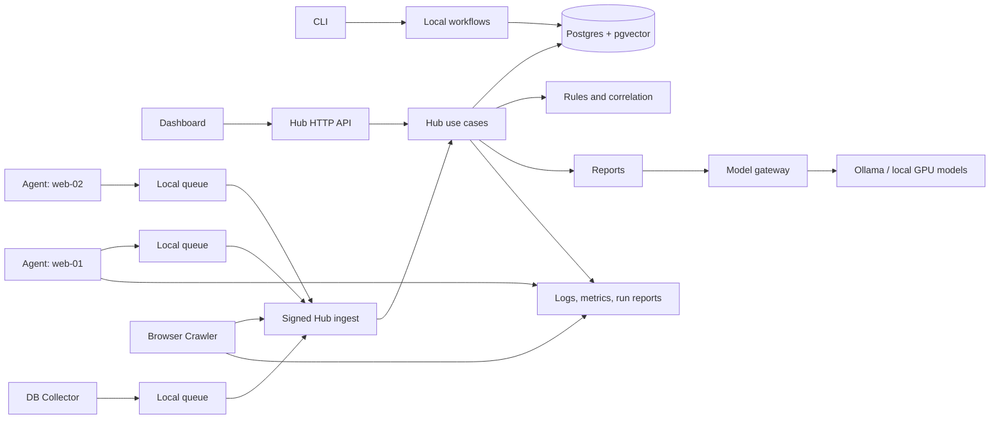

# Architecture

## Architectural Style

Aegrail should start as one repository with multiple runtime apps behind one `aegrail` binary:

- Local CLI workflows
- Hub API and correlation workflows
- Agent runtime
- Collector runtime
- Dashboard frontend

The first implementation can be a modular monolith in Go. The package boundaries should still allow Hub, Agent, Collector, dashboard, and workers to scale into separate services later.

## High-Level Diagram



## Runtime Apps

### 1. Local

Responsibilities:

- initialize local workspaces
- import local evidence
- run local scans and reports
- support one-off incident work without a Hub

### 2. Hub

Responsibilities:

- receive signed event batches
- store distributed inventory
- store normalized events and findings
- compare baselines across hosts
- run correlation rules
- expose read APIs for dashboard and reports

### 3. Agent

Responsibilities:

- run on monitored servers
- watch files, logs, cron, deployment markers, local app state, and environment changes
- queue events offline
- replay events to the Hub
- load one server-level config with many monitored sites

### 4. Collector

Responsibilities:

- run database collectors
- run browser crawlers
- support platform adapters such as Pantheon
- produce normalized events and snapshots through the same Hub ingest path

### 5. Dashboard

Responsibilities:

- show overview, findings, timeline, inventory, sites, agents, browser scripts, deployments, reports, and settings
- make coverage gaps visible
- support triage actions such as acknowledge, false positive, report export, and browser script allowlist
- call Hub APIs only; never duplicate rule logic

## Core Modules

### Evidence Collection

Owns file watching, log tailing, database snapshots, browser crawling, deployment markers, and offline queues.

### Normalization

Owns canonical event types, redaction, timestamps, context labels, payload shape, and evidence references.

### Inventory

Owns organizations, projects, environments, apps, services, hosts, agents, deployment markers, and monitored-site coverage.

### Storage

Owns PostgreSQL migrations, repositories, immutable evidence metadata, event storage, findings, reports, vector chunks, and indexes.

### Detection And Correlation

Owns deterministic rules, risk scoring, deduplication, allowlists, cross-host correlation, and incident chains.

### AI And Reports

Owns model gateway behavior, redacted evidence bundles, prompt versions, Markdown and JSON reports, and generated analysis storage.

### API And UI

Owns chi HTTP routing, authentication, dashboard endpoints, response DTOs, and static dashboard delivery.

## Deployment Shape

### Local Developer

```text
aegrail CLI
postgres18 + pgvector
ollama on local GPU
optional browser executable for rendered crawls
```

### Single Hub Pilot

```text
aegrail hub serve
postgres primary + backups
ollama private endpoint
dashboard behind reverse proxy
agents on monitored servers
```

### Distributed Production

```text
aegrail-hub-api
aegrail-worker
aegrail-agent per server
aegrail-db-collector per database cluster
aegrail-browser-collector scheduled
postgres primary + read replicas
redis or nats for durable jobs if needed
model gateway
observability stack
```

### Managed Platform Monitoring

Pantheon and similar providers should be provider adapters around the same WordPress model:

- access logs through SFTP or provider APIs
- database snapshots through backups, Terminus, or read-only access where available
- Multisite represented as one app with logical network sites

## Key Design Decision

Aegrail must not let the LLM become the detector of record. Detection, scoring, and correlation should remain deterministic, explainable, testable, and reproducible. LLMs help with synthesis, explanation, and report drafting after evidence is collected and rules have run.
