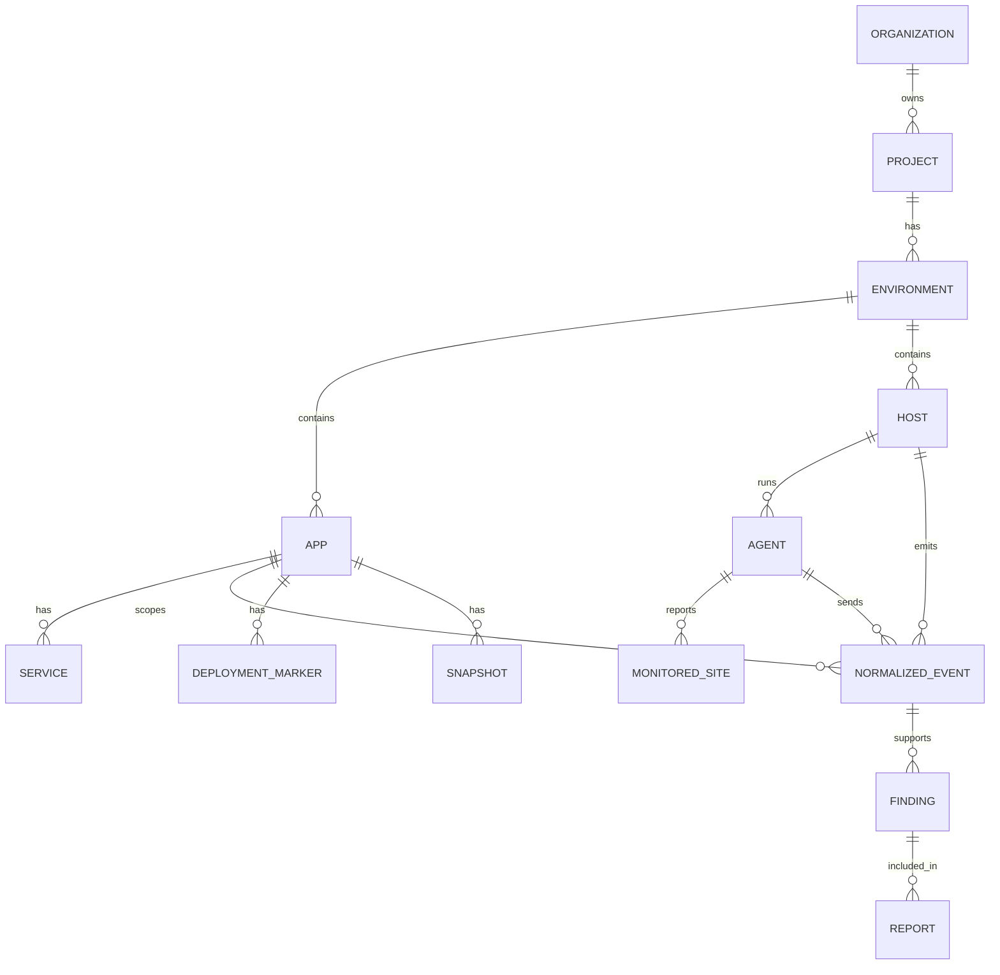

# Domain Model

## Main Concepts

### Organization

An organization owns projects and reporting boundaries.

Fields:

- slug
- display name
- labels
- created time

### Project

A project groups one customer estate, product estate, or operational scope.

Examples:

- customer-site
- hosted-wordpress-fleet
- ecommerce-production

### Environment

An environment separates production, staging, local, and other deployment contexts.

Rules:

- findings and timelines are normally scoped by environment
- deployment markers are environment-specific
- credentials and configs must not cross environments

### App / Site

An app is the monitored application or logical site in the Hub.

Examples:

- example-com
- example2-com
- main-web
- wordpress-network
- prestashop-shop

Fields:

- slug
- display name
- kind: wordpress, wordpress-multisite, prestashop, mautic, yii2, laravel, generic-php
- primary domain
- labels

### Service

A service is a functional component of an app.

Examples:

- frontend
- database
- worker
- cron
- browser

### Host

A host is a server, container host, database host, worker host, or managed-platform logical source.

Fields:

- host slug
- hostname
- region
- labels
- environment

### Agent

An agent is the installed Aegrail process identity on a host.

Fields:

- agent ID
- host
- fingerprint
- version
- last seen
- queue status
- config coverage

### Monitored Site

A monitored site is a per-server config entry telling an agent what to watch.

It maps one local root, logs, database DSNs, browser crawl seeds, and labels into Hub app/service context.

Example:

```yaml
slug: example-com
domain: example.com
kind: wordpress
app: example-com
service: frontend
root: /var/www/example.com
```

### Evidence Object

An evidence object is immutable source material or metadata from a scan.

Examples:

- copied local file
- log import manifest
- file hash observation
- database snapshot
- browser script observation
- report artifact

### Normalized Event

A normalized event is the timeline unit.

Fields:

- event time
- Hub received time
- org/project/environment
- app/service/host/agent
- type
- target
- severity
- payload
- evidence refs
- labels

### Snapshot And Baseline

A snapshot is point-in-time observed state.

Examples:

- WordPress users
- PrestaShop modules
- file inventory
- browser script inventory
- database settings

A baseline is an accepted reference for comparing later snapshots or events.

### Finding

A finding is a deterministic rule result.

Fields:

- rule ID and version
- severity
- confidence
- status
- summary
- evidence refs
- dedupe key
- related events
- recommended next checks

### Incident Chain

An incident chain is a correlated sequence of events that likely belong together.

Example:

```text
failed admin logins -> successful admin login -> PHP file in uploads -> role change -> cron persistence
```

### Deployment Marker

A deployment marker tells Aegrail when expected changes happened.

Fields:

- start and end time
- version
- commit
- actor
- environment
- app

### Browser Script Allowlist

An allowlist entry records reviewed JavaScript observations:

- script domain
- script URL
- inline hash
- tag manager ID
- scope
- reason
- reviewer

### Report

A report is a generated output from findings and evidence.

Reports can be:

- JSON
- Markdown technical report
- Markdown manager summary
- CSV timeline export

## Relationship Overview



## Design Rules

- Store original evidence and generated analysis separately.
- Store event time and Hub received time separately.
- Keep host identity separate from per-site app/service context.
- Use UTC for stored timestamps.
- Redact sensitive values before reports, embeddings, prompts, and dashboard list views.
- Make all findings traceable to events or evidence refs.
- Keep rule outputs stable enough for golden tests.
