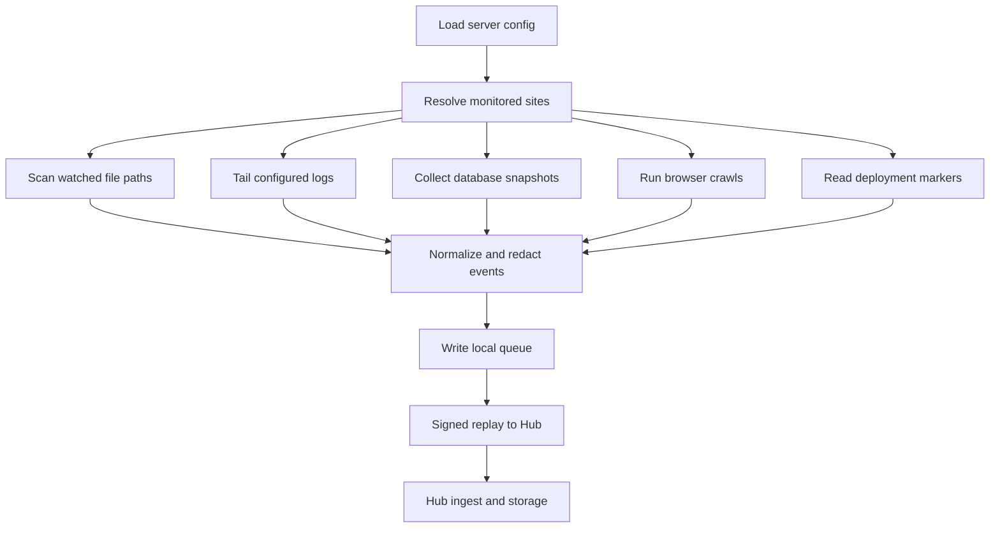

# Evidence Collection

## Goals

Aegrail should collect high-signal evidence from PHP application estates without becoming noisy, fragile, or lossy.

It should prefer:

- file changes in writable or executable-risk paths
- web and PHP log events
- WordPress and PrestaShop database state
- browser-rendered JavaScript observations
- deployment markers
- cron and worker changes
- host and agent health

It should avoid by default:

- storing plaintext secrets
- replaying huge historical logs without operator intent
- treating deployment churn as compromise without context
- sending unauthenticated events
- losing local evidence when the Hub is temporarily unavailable

## Collection Pipeline



## Agent Multi-Site Configuration

One server should run one agent with many site entries:

```yaml
identity:
  org: acme
  project: hosted-sites
  environment: production
  host: web-01
  agent_id: agt_web_01

sites:
  - slug: example-com
    kind: wordpress
    app: example-com
    service: frontend
    root: /var/www/example.com
    files:
      profiles: [wordpress]
    logs:
      - path: /var/log/nginx/example.com.access.log
        kind: nginx_access
    databases:
      - engine: mysql
        dsn_env: AEGRAIL_DB_EXAMPLE_COM_DSN
        profile: wordpress
```

Host identity is shared. Site context is applied per event.

Detailed config plan: [Agent Multi-Site Configuration](configuration/agent-multi-site.md).

## File Watching

Initial profiles:

- `wordpress`
- `prestashop`

WordPress high-signal paths:

- `wp-config.php`
- `wp-content/uploads`
- `wp-content/plugins`
- `wp-content/themes`
- `wp-content/mu-plugins`

PrestaShop high-signal paths:

- `config`
- `app/config`
- `modules`
- `themes`
- `upload`
- `img`
- `var/logs`

The first scan creates a baseline. Later scans emit:

- `file.created`
- `file.modified`
- `file.deleted`

Each site needs isolated state:

```text
state/sites/example-com/file-watch.json
state/sites/example2-com/file-watch.json
```

## Log Tailing

Initial log sources:

- Nginx access logs
- Apache access logs
- PHP error logs

The first log scan records offsets. Later scans emit redacted events such as:

- `log.access`
- `log.php_error`

The payload should keep useful details such as path, method, status, IP hash where appropriate, user agent, and line hash while redacting secrets from query strings, cookies, tokens, and credentials.

## Database Snapshots

Database collectors should use read-only credentials where possible.

Current implementation:

- `agent run --config` executes configured MySQL/MariaDB database checks for each site.
- `dsn_env` is required; literal DSNs are rejected by config validation.
- Missing DSN environment variables become `db.coverage.warning` events so other site collection continues.
- Raw option/config values are not emitted. Snapshot events keep counts, byte lengths, and SHA-256 digests.
- Entity snapshots now cover redacted WordPress users/capabilities, tracked WordPress options, active plugin identities, active theme identities, and PrestaShop employees/modules.
- User and employee emails/logins are hashed before they become local state or Hub events.
- WordPress option values are not emitted raw. Aegrail stores option names, byte lengths, SHA-256 digests, and derived safe identifiers such as plugin basenames and theme slugs.
- WordPress Multisite network options are collected from `wp_sitemeta` when that table exists, including network-active plugins and site-admin metadata as redacted fingerprints.
- The first good snapshot creates local baseline state under the configured site state directory.
- Later snapshots emit redacted diff events such as `db.snapshot.check_changed`, `db.entity.added`, and `db.entity.changed`.
- Warning-only snapshots do not replace the previous known-good DB state.
- Hub correlation turns first-wave WordPress and PrestaShop DB diff events into deterministic findings.
- Full row snapshots, exact cron parsing, post/widget/builder DB content parsing, and PostgreSQL collector support are still planned.

Minimum WordPress checks:

- users
- administrator roles
- usermeta capabilities
- options
- active plugins and themes
- cron tasks
- suspicious script-bearing posts, pages, widgets, and builder content

Minimum PrestaShop checks:

- employees
- SuperAdmin status
- sessions and recent logins
- configuration values
- modules
- tabs
- hooks
- access rules

Only one collector should monitor each database cluster unless explicitly configured otherwise.

## Browser Crawling

The browser crawler should collect public page JavaScript evidence:

- page URL
- external script domains
- script URLs
- inline script hashes
- tag manager IDs
- rendered-only scripts
- crawl timing and errors

Rendered mode should support:

- browser readiness waits
- network quiet waits
- optional tag manager wait
- bounded settle delay
- hard timeout

Detailed crawler plan: [Browser Crawler And JavaScript Monitoring Plan](collectors/browser-crawler.md).

## Pantheon WordPress

Pantheon should be treated as a hosting provider adapter around WordPress.

Minimum viable collection:

- SFTP access logs
- application logs where available
- database snapshots from backups, Terminus, or read-only connections
- Multisite network metadata

Detailed provider plan: [Pantheon WordPress Monitoring Plan](platforms/pantheon-wordpress.md).

## Queue And Offline Mode

Agents should never drop evidence just because the Hub is temporarily unreachable.

Queue rules:

- write pending batches locally first
- sign requests when sending to the Hub
- move sent batches only after a successful Hub response
- keep failed batches inspectable
- report queue status to the Hub and dashboard

## Run Reporting

Every recurring collection path should eventually report:

- start and end time
- site count
- files scanned
- log lines processed
- database rows or entities scanned
- browser pages crawled
- events queued
- events sent
- failures by source
- skipped paths and reasons

Operational trust comes from knowing what was checked, not only that the process exited.
