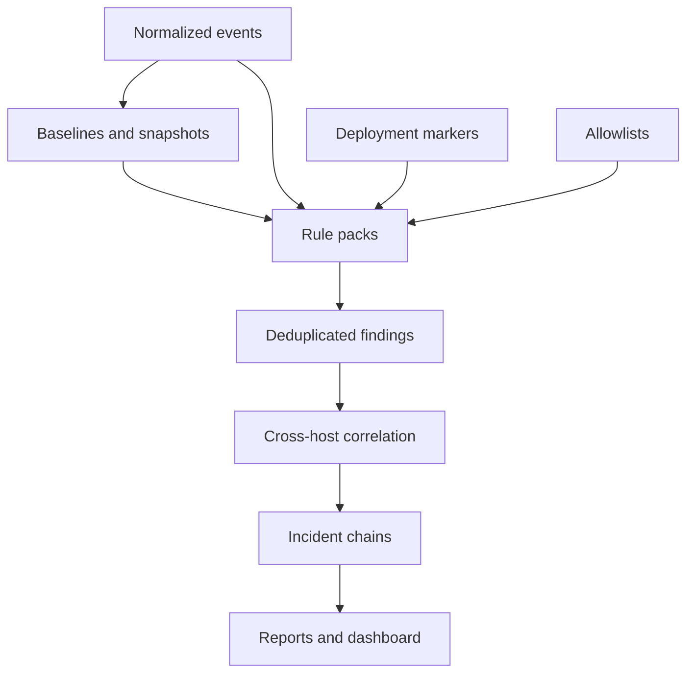

# Detection And Correlation

## Detection Philosophy

Aegrail should produce deterministic, explainable findings before any generated analysis is added.

The system should answer:

- what changed?
- where did it change?
- when did it change?
- which host, app, service, and agent observed it?
- was a deployment active?
- what evidence supports the finding?
- what should an operator check next?

## Detection Pipeline



## First-Wave Rule Areas

### Generic PHP

High-signal findings:

- PHP file created under writable directories
- executable file changed outside deploy window
- sensitive config file changed
- suspicious filename or path pattern
- unexpected cron or worker script
- web request followed by local file creation

### WordPress

High-signal findings:

- new administrator account
- changed user capabilities
- suspicious option value
- new or changed plugin
- new or changed theme
- unexpected `wp-cron` task
- script-bearing content change in posts, pages, widgets, or builder data
- PHP file under uploads or writable content directories

### PrestaShop

High-signal findings:

- new employee account
- new SuperAdmin account
- employee profile or password timestamp change
- suspicious configuration value
- new or changed module
- suspicious admin controller or tab
- hook or access-rule change

### Database Snapshot Diffs

Current deterministic DB diff finding rules:

- `wordpress-admin-user-added`
- `wordpress-user-became-admin`
- `wordpress-user-capabilities-changed`
- `wordpress-admin-user-removed`
- `wordpress-active-plugin-added`
- `wordpress-active-plugin-removed`
- `wordpress-active-plugin-changed`
- `wordpress-active-plugins-option-changed`
- `wordpress-active-theme-changed`
- `wordpress-registration-option-changed`
- `wordpress-network-admins-option-changed`
- `wordpress-identity-option-changed`
- `wordpress-user-roles-option-changed`
- `wordpress-option-entity-changed`
- `wordpress-suspicious-cron-task-added`
- `wordpress-cron-task-became-suspicious`
- `wordpress-cron-task-added`
- `wordpress-cron-task-changed`
- `wordpress-script-content-added`
- `wordpress-script-content-domain-added`
- `wordpress-script-content-changed`
- `wordpress-admin-users-changed`
- `wordpress-users-changed`
- `wordpress-active-plugins-changed`
- `wordpress-theme-option-changed`
- `wordpress-cron-option-changed`
- `wordpress-options-changed`
- `prestashop-superadmin-employee-added`
- `prestashop-employee-became-superadmin`
- `prestashop-employee-changed`
- `prestashop-active-module-added`
- `prestashop-module-entity-changed`
- `prestashop-suspicious-configuration-changed`
- `prestashop-payment-configuration-changed`
- `prestashop-mail-configuration-changed`
- `prestashop-security-configuration-changed`
- `prestashop-sensitive-configuration-changed`
- `prestashop-configuration-entity-changed`
- `prestashop-employees-changed`
- `prestashop-modules-changed`
- `prestashop-configuration-changed`
- `prestashop-access-rules-changed`
- `prestashop-hooks-changed`
- `prestashop-tabs-changed`

These rules operate on redacted snapshot diff events: counts, byte lengths, SHA-256 digests, and entity fingerprints. User and employee names/emails are hashed; module names, WordPress plugin basenames, and theme slugs may be kept when they are operational evidence rather than credentials. Raw option/config values are not exposed in findings.

### Browser JavaScript

High-signal findings:

- new external script domain
- new script URL on important pages
- new inline script hash
- new tag manager ID
- rendered-only script drift
- script drift after suspicious admin activity

## Correlation Examples

### Single Host Web Compromise

```text
failed admin logins
successful admin login
PHP file created in uploads
PHP error from same path
outbound script domain appears on home page
```

### Multi-Host Application Drift

```text
web-01 index.php hash = expected
web-02 index.php hash = changed
deployment window = none
finding = application file differs between production web nodes
```

### Distributed Incident Chain

```text
19:01 web-01 failed admin login attempts
19:02 web-02 successful admin login from same IP hash
19:04 web-02 new PHP file in uploads
19:04 db-01 administrator role changed
19:05 worker-01 new cron job created
```

Possible chain:

```text
suspicious login activity -> file change -> database privilege change -> persistence attempt
```

## Severity And Confidence

Severity should reflect potential impact:

- `critical`: likely active compromise or privileged persistence
- `high`: strong evidence of dangerous change
- `medium`: suspicious drift requiring review
- `low`: weak signal or expected-risk context
- `info`: useful timeline context

Confidence should reflect evidence quality:

- source count
- rule specificity
- baseline comparison
- deployment context
- correlation with other events
- allowlist status

## Deduplication

Findings should have stable dedupe keys so repeated scans do not flood the operator.

Good dedupe inputs:

- rule ID
- org/project/environment
- app/service/host where relevant
- target
- normalized payload hash
- baseline window

## Rule Registry

Hub rules are registered with versioned metadata:

- rule ID
- rule version
- category
- supported platforms
- evidence types
- dashboard/action hints

Current categories are `correlation`, `database_snapshot`, and `browser_script`. Findings copy the matching rule metadata into their own metadata, and the Hub exposes the registry through `GET /api/v1/rules`. This lets the CLI, dashboard, and reports use the same rule labels and actions.

## Finding Lifecycle

Persisted Hub findings have a small triage lifecycle:

- `open`
- `acknowledged`
- `false_positive`
- `resolved`

Status changes store a reason, note, actor, and update time. Re-running deterministic rules refreshes evidence and severity while preserving the operator's triage status for the same dedupe key.

Status can be changed through the Hub API or the local CLI:

```bash
aegrail hub findings status --org acme --project customer-site --env production --id finding-id --status acknowledged --reason reviewed --actor roman
```

## Allowlists

Allowlists should be narrow and reviewable:

- browser script domain
- browser script URL
- inline script hash
- tag manager ID
- file path pattern
- known deployment actor

An allowlist entry must carry scope, reason, reviewer, and time.

Browser script allowlist entries can be created from drift review and later disabled without deleting review history. The Hub API and CLI both use `active` and `disabled` statuses, and drift matching only suppresses values from active entries.

Browser drift findings can be handed off directly into the allowlist. The handoff reads the finding metadata (`kind`, `page_url`, and `value`), validates that the finding came from a browser script drift rule, and creates the reviewed allowlist entry without asking the operator to retype evidence values.

## Dashboard Views

The dashboard should expose:

- Overview
- Findings
- Timeline
- Inventory
- Sites
- Agents
- Browser Scripts
- Deployments
- Reports
- Settings

The dashboard should read Hub data and perform triage actions. It should not run hidden detection logic in the browser.

## Evaluation

Aegrail needs fixture-based evaluation sets:

- clean WordPress install
- compromised WordPress uploads
- WordPress administrator role change
- PrestaShop module drift
- PrestaShop employee privilege escalation
- browser script injection
- multi-host file drift
- deploy-window false-positive case

Every rule change should be testable against known clean and suspicious fixtures.
