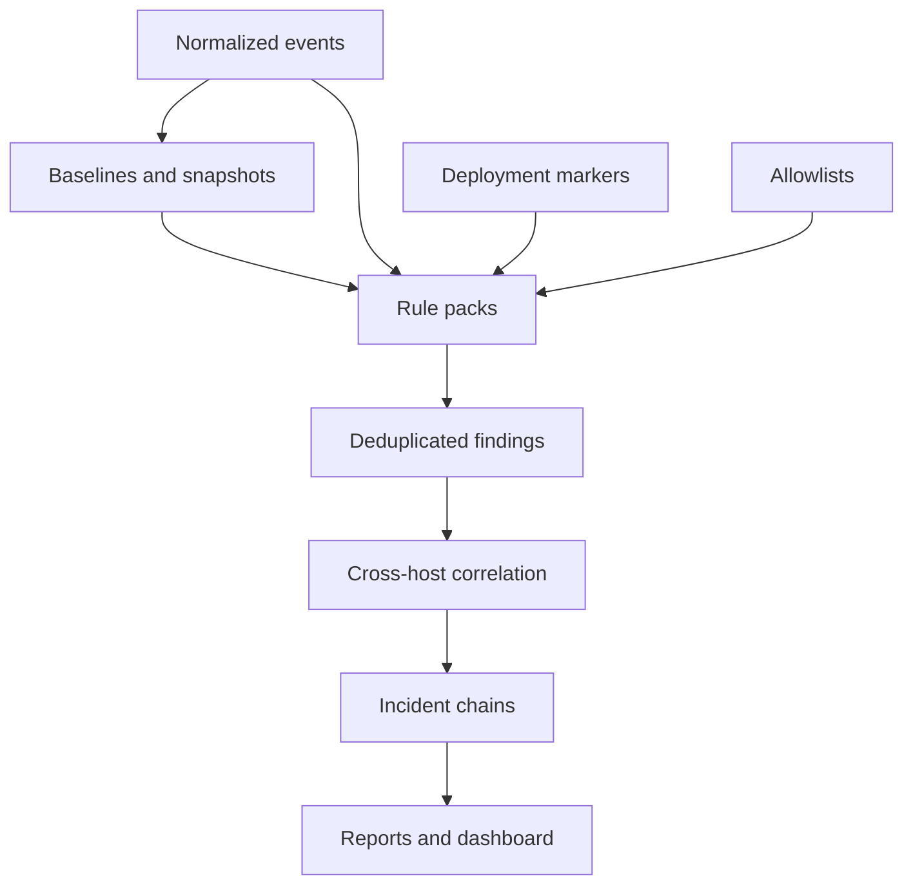

# Detection And Correlation

## Detection Philosophy

Aegrail should produce deterministic, explainable findings before any generated analysis is added.

The system should answer:

- what changed?
- where did it change?
- when did it change?
- which host, app, service, and agent observed it?
- was a deployment active?
- what evidence supports the finding?
- what should an operator check next?

## Detection Pipeline



## First-Wave Rule Areas

### Generic PHP

High-signal findings:

- PHP file created under writable directories
- executable file changed outside deploy window
- sensitive config file changed
- suspicious filename or path pattern
- unexpected cron or worker script
- web request followed by local file creation

### WordPress

High-signal findings:

- new administrator account
- changed user capabilities
- suspicious option value
- new or changed plugin
- new or changed theme
- unexpected `wp-cron` task
- script-bearing content change in posts, pages, widgets, or builder data
- PHP file under uploads or writable content directories

### PrestaShop

High-signal findings:

- new employee account
- new SuperAdmin account
- employee profile or password timestamp change
- suspicious configuration value
- new or changed module
- suspicious admin controller or tab
- hook or access-rule change

### Browser JavaScript

High-signal findings:

- new external script domain
- new script URL on important pages
- new inline script hash
- new tag manager ID
- rendered-only script drift
- script drift after suspicious admin activity

## Correlation Examples

### Single Host Web Compromise

```text
failed admin logins
successful admin login
PHP file created in uploads
PHP error from same path
outbound script domain appears on home page
```

### Multi-Host Application Drift

```text
web-01 index.php hash = expected
web-02 index.php hash = changed
deployment window = none
finding = application file differs between production web nodes
```

### Distributed Incident Chain

```text
19:01 web-01 failed admin login attempts
19:02 web-02 successful admin login from same IP hash
19:04 web-02 new PHP file in uploads
19:04 db-01 administrator role changed
19:05 worker-01 new cron job created
```

Possible chain:

```text
suspicious login activity -> file change -> database privilege change -> persistence attempt
```

## Severity And Confidence

Severity should reflect potential impact:

- `critical`: likely active compromise or privileged persistence
- `high`: strong evidence of dangerous change
- `medium`: suspicious drift requiring review
- `low`: weak signal or expected-risk context
- `info`: useful timeline context

Confidence should reflect evidence quality:

- source count
- rule specificity
- baseline comparison
- deployment context
- correlation with other events
- allowlist status

## Deduplication

Findings should have stable dedupe keys so repeated scans do not flood the operator.

Good dedupe inputs:

- rule ID
- org/project/environment
- app/service/host where relevant
- target
- normalized payload hash
- baseline window

## Allowlists

Allowlists should be narrow and reviewable:

- browser script domain
- browser script URL
- inline script hash
- tag manager ID
- file path pattern
- known deployment actor

An allowlist entry must carry scope, reason, reviewer, and time.

## Dashboard Views

The dashboard should expose:

- Overview
- Findings
- Timeline
- Inventory
- Sites
- Agents
- Browser Scripts
- Deployments
- Reports
- Settings

The dashboard should read Hub data and perform triage actions. It should not run hidden detection logic in the browser.

## Evaluation

Aegrail needs fixture-based evaluation sets:

- clean WordPress install
- compromised WordPress uploads
- WordPress administrator role change
- PrestaShop module drift
- PrestaShop employee privilege escalation
- browser script injection
- multi-host file drift
- deploy-window false-positive case

Every rule change should be testable against known clean and suspicious fixtures.
