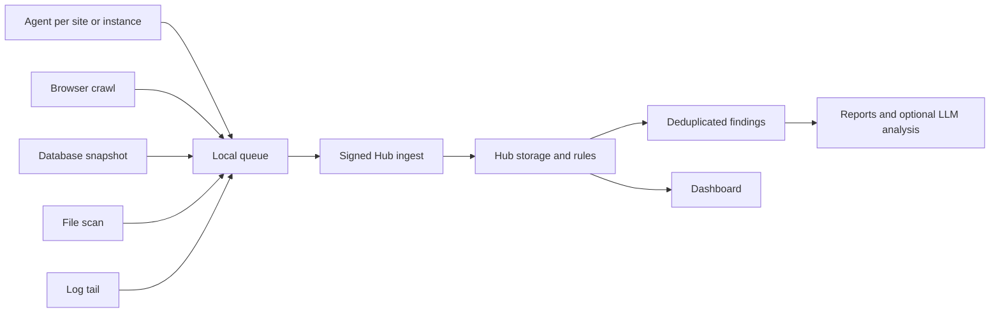

# Aegrail Documentation

This is the maintained project document. Older strategy notes, scratch specs, and duplicated implementation plans were removed so this file stays the source of truth.

## What Aegrail Is

Aegrail is a monitoring and incident-triage tool for freelancer and small-team operations across WordPress, PrestaShop, and PHP estates.

The product is deliberately not a giant commercial SIEM. It should help an operator see:

- which companies and sites are healthy
- which nodes and agents are reporting
- what changed in files, database state, browser-rendered scripts, logs, and coverage
- which issues need attention
- what can be marked reviewed, fixed, or false positive
- what evidence can be turned into a short report

Detection is deterministic first. LLM analysis is optional and must work from redacted evidence bundles, not replace the rule engine.

## Repository Map

```text
app/        Go module for the aegrail binary, Hub, Agent, collectors, rules, reports, and storage.
dashboard/  React dashboard for Hub APIs.
services/   Local infrastructure for development.
data/       Local runtime output; keep private and uncommitted.
docs/       This documentation plus brand assets.
```

## Runtime Model



Main responsibilities:

- Agent: loads config, scans one or more configured sites, queues evidence locally, replays to Hub, and reports coverage.
- Hub: stores inventory, events, findings, deployments, browser allowlists, reports, users, and rule metadata.
- Dashboard: reads Hub APIs and performs triage actions. It does not run hidden detection logic.
- Reports: export deterministic findings and timelines; optional model reports are stored with prompt and evidence provenance.

## Data Structure

Aegrail uses this hierarchy in the Hub and dashboard:

```text
Company
  Site / Project
    Instance / Node
      Services
        Evidence events
        Findings / issues
```

Definitions:

- Company maps to a Hub organization.
- Site or project maps to a Hub project/app view used by the dashboard.
- Instance or node maps to a host plus an agent identity.
- Service is the observed role, such as `frontend`, `database`, `browser`, `config`, or `agent`.
- Event is a normalized observation: file, log, database, browser, coverage, deployment, or system context.
- Finding is an actionable issue generated by deterministic rules and tied to event IDs.

Finding statuses:

- `open`
- `acknowledged`
- `resolved`
- `false_positive`

Status changes keep reason, note, actor, and timestamp. Re-running rules refreshes evidence for the same dedupe key without losing triage state.

## Evidence Collection

Agents collect evidence from configured sites:

- File scans: created, modified, deleted files, with app-relative paths where possible.
- Logs: access logs and PHP errors with secret-bearing query values redacted.
- Databases: read-only WordPress and PrestaShop snapshots.
- Browser crawls: rendered script URLs, domains, inline hashes, and tag manager IDs.
- Coverage: what collectors are enabled for each site.

The first baseline run should not create issue noise:

```powershell
cd app
go run ./cmd/aegrail agent run --config configs/agent.multi-site.example.yaml --once --bootstrap
```

If old local test batches are pending and should not be sent:

```powershell
go run ./cmd/aegrail agent run --config configs/agent.multi-site.example.yaml --once --bootstrap --discard-pending
```

Then run without `--bootstrap` for normal monitoring.

## Privacy And Redaction

Aegrail must be useful without leaking private project details.

Rules:

- Do not commit real customer paths, domains, database DSNs, passwords, tokens, cookies, or environment dumps.
- Agent coverage payloads should not include local filesystem roots.
- Database DSNs must come from environment variables such as `dsn_env`; literal DSNs with passwords should be rejected.
- Raw WordPress option values and PrestaShop configuration values are not emitted.
- User and employee emails/logins are never sent raw. Findings may include masked display hints such as `r***n@example.com`.
- Set `AEGRAIL_PII_KEY` on agents that collect database users or employees so stable HMAC fingerprints can be generated.
- `AEGRAIL_HUB_INGEST_SECRET` signs agent-to-Hub requests. It is separate from the PII key.
- Evidence sent to LLMs must be compact, redacted, and hashable.

## Detection And Findings

Current rule families:

- Database snapshot and entity changes for WordPress and PrestaShop.
- Suspicious file path changes, including PHP under writable paths and sensitive config changes.
- Grouped plugin, theme, and module file changes so a new extension does not create a wall of separate issues.
- Browser script drift, including new domains, URLs, inline hashes, and tag manager IDs.
- Web/admin request anomalies from normalized logs.
- Multi-host file baseline drift.
- Correlated incident chains such as web activity followed by file and database changes.

Finding metadata should be operator-friendly:

- Database user issues should show a masked account when available.
- File issues should group related files and show a capped changed-file list.
- Risk metadata records severity, confidence, rule category, event count, host count, deployment context, score, and band.
- Deployment windows can lower expected low/medium drift but must not hide high-risk administrator, payment, persistence, or incident-chain findings.

Rule evaluation:

```powershell
cd app
go run ./cmd/aegrail hub rules evaluate --fail-on-mismatch
```

## Agent Configuration

The config schema is `aegrail.agent.server_config.v1`.

Reduced example:

```yaml
schema: aegrail.agent.server_config.v1

hub:
  url: http://127.0.0.1:8787
  ingest_secret_env: AEGRAIL_HUB_INGEST_SECRET

identity:
  org: acme
  project: customer-sites
  environment: production
  host: web-01
  agent_id: agt_web_01

runtime:
  queue_dir: C:\aegrail\queue
  state_dir: C:\aegrail\state
  interval: 30s

sites:
  - slug: example-wordpress
    domain: example.test
    app: example-wordpress
    service: frontend
    kind: wordpress
    root: C:\sites\example-wordpress
    files:
      profiles: [wordpress]
    databases:
      - name: wordpress
        engine: mysql
        profile: wordpress
        table_prefix: wp_
        dsn_env: AEGRAIL_DB_EXAMPLE_WORDPRESS_DSN
        schedule: 5m
    browser_crawl:
      enabled: true
      rendered: true
      urls:
        - https://example.test/
```

Validation and run commands:

```powershell
cd app
go run ./cmd/aegrail agent config validate --config configs/agent.multi-site.example.yaml
go run ./cmd/aegrail agent run --config configs/agent.multi-site.example.yaml --once
go run ./cmd/aegrail agent run --config configs/agent.multi-site.example.yaml
```

For a commented reference containing every supported agent YAML option, see `app/configs/agent.full.example.yaml`.

Notes:

- WordPress profiles include `wp-config.php`, `wp-config-local.php`, uploads, plugins, themes, and mu-plugins.
- PrestaShop profiles include config, modules, themes, upload/img/media-like paths, and logs where configured.
- Database `schedule` controls how often a database snapshot runs; file/browser/config checks can run more frequently.
- Provider-managed nodes can disable unavailable local collectors with `files.enabled: false` and can mark config coverage as intentionally disabled with `coverage.enabled: false`.
- Config coverage emits a periodic heartbeat, even when unchanged, so dashboards can distinguish stale data from an intentionally quiet site.
- Missing DSN environment variables should produce coverage warnings rather than stopping unrelated site scans.

## Dashboard

The dashboard is for quick operational judgement:

- Overview: up to six companies sorted by severity, with site summaries.
- Companies: all companies and health counts.
- Sites: company/site drilldown.
- Nodes: instances, agents, services, and issue actions.
- Issues: active queue with details, evidence, action buttons, and report export.
- Timeline: raw observations for debugging.
- Browser Scripts: script observations and allowlist actions.
- Reports: deterministic and model-assisted reports.
- Settings: Hub scope, auth users, access levels, and 2FA enrollment.

The main dashboard surface should stay simple: show what is wrong, where, why, and what action can be taken.

Dashboard development:

```powershell
cd dashboard
npm install
npm run dev
```

Build and serve from Hub:

```powershell
cd dashboard
npm run build
cd ..\app
go run ./cmd/aegrail hub serve --dashboard-dir ..\dashboard\dist
```

## Local Hub Runbook

Start PostgreSQL:

```powershell
docker compose -f services/compose.yaml up -d postgres18
```

Run migrations:

```powershell
cd app
go run ./cmd/aegrail db migrate
```

Start Hub:

```powershell
go run ./cmd/aegrail hub serve --dashboard-dir ..\dashboard\dist
```

Useful CLI commands:

```powershell
go run ./cmd/aegrail --help
go run ./cmd/aegrail inventory bootstrap single-site --kind wordpress --org acme --project customer-site --host web-01 --agent-id agt_web_01 --fingerprint SHA256:test
go run ./cmd/aegrail hub findings list --org acme --project customer-site --env production --app main-web
go run ./cmd/aegrail hub rules evaluate --fail-on-mismatch
go run ./cmd/aegrail report hub-findings --org acme --project customer-site --env production --format markdown --output ..\data\reports\hub-findings.md
go run ./cmd/aegrail report timeline --org acme --project customer-site --env production --since 24h --format csv --output ..\data\reports\timeline.csv
go test ./...
```

## Security Checklist

Before using Aegrail on real projects:

- Use a strong `AEGRAIL_HUB_INGEST_SECRET`.
- Use a separate strong `AEGRAIL_PII_KEY`.
- Keep Hub behind local network/VPN/reverse proxy authentication.
- Use HTTPS or a trusted private tunnel for agent-to-Hub traffic outside localhost.
- Use read-only database users where possible.
- Keep `data/`, `.aegrail/`, queue directories, state directories, and generated reports out of Git.
- Review findings before creating reports for customers.
- Do not paste local project paths or real customer environment values into docs.

## Development Standards

- Business logic belongs in Hub, Agent, Collector, report, and module packages, not CLI or HTTP glue.
- Redaction should happen before dashboard responses, reports, evidence bundles, or model prompts.
- Deterministic tests must not require Ollama.
- Dashboard UI should read Hub APIs only.
- Keep docs generic. Use example domains and paths only.

Verification commands:

```powershell
cd app
go test ./...

cd ..\dashboard
npm run build
```

## Tracker

Done:

- One `aegrail` Go binary with Hub, Agent, Collector, Local, reports, and migrations.
- PostgreSQL storage and local Docker service.
- Signed Hub ingest.
- Distributed inventory: organizations, projects, environments, apps, services, hosts, agents.
- Multi-site agent config loading, validation, file scans, log tailing, database checks, browser crawls, queueing, replay, and coverage reporting.
- WordPress and PrestaShop database snapshots with redacted entity diffs.
- WordPress Multisite network option support.
- `wp-config-local.php` included in WordPress file coverage.
- Browser script observations and allowlist workflow.
- Deterministic rule registry, risk scoring, deployment context, and fixture evaluation.
- Finding lifecycle actions.
- Dashboard refactor into modular React app.
- Dashboard overview/company/site/node/issues/timeline/browser/report/settings views.
- Dashboard auth users, access levels, and 2FA enrollment.
- Grouped file findings for plugin/theme/module changes.
- Masked account display in DB user findings.

Next:

- Polish dashboard issue resolution flow so each warning clearly says why it exists and what action is expected.
- Add tighter filters for expected cache/upload churn and allowed CMS-generated paths.
- Add report views that make deterministic reports and model reports easier to compare.
- Improve operational setup scripts for local Hub plus multiple agents.
- Add notification hooks after the issue model is stable.

Later:

- Remote collectors for provider-managed sites.
- Pantheon and other hosting adapters.
- Scheduled Hub-side jobs.
- Per-agent secrets or mTLS.
- Audit log and retention settings.
- More CMS/framework profiles beyond WordPress and PrestaShop.

## Documentation Maintenance

Keep this file current when behavior changes. Do not add one-off design markdown files at the repo root. If a topic becomes too large, add a short section here first and split it only when it has a clear owner and maintenance path.
