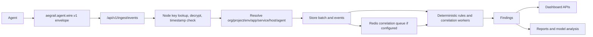

# Hub How It Works

The Hub receives encrypted evidence batches from Agents and turns them into inventory, timeline events, findings, reports, and dashboard data.

## Runtime Flow

## Storage

PostgreSQL stores:

- inventory: organizations, projects, environments, apps, services, hosts, agents
- ingest batches and normalized events
- findings, status history, file ignore rules, browser allowlists
- deployment markers
- model analysis reports and provenance
- dashboard users, sessions, and encrypted TOTP material
- browser-push subscriptions for dashboard users

Dashboard inventory tree reads use a fixed-query PostgreSQL path so the
overview does not generate one query per company/site/node. Topology reads for
one environment use a scoped query path instead of loading the full tree. Test
and custom repositories can fall back to the slower nested walk without
changing the API.

Redis is optional but recommended when monitoring many sites. Hub uses it for short-lived ingest-correlation jobs, distributed worker locks, and shared auth rate limiting. Durable evidence, findings, users, sessions, and reports stay in PostgreSQL.

The Hub process validates required security secrets at startup in `serve` mode.
`AEGRAIL_DATABASE_URL` is required so production does not silently fall back to
local insecure credentials. `AEGRAIL_HUB_WIRE_PRIVATE_KEY` is required before
Agent ingest can decrypt wire envelopes, and `AEGRAIL_HUB_USER_SECRET` is
required before dashboard TOTP material and CSRF tokens can be used safely.
Hub derives the TOTP-at-rest encryption key with HKDF-SHA-256 and stores only
AES-GCM ciphertext for pending and active TOTP secrets.

## Ingest

Agents submit encrypted wire envelopes to `POST /api/v1/ingest/events`.

The Hub:

1. reads the request body with a size limit
2. detects `aegrail.agent.wire.v1`
3. looks up the node by `node_id`
4. derives the shared X25519 key from Hub private key and node public key
5. decrypts AES-GCM ciphertext with schema/node/timestamp as associated data
6. rejects timestamps outside the configured skew window
7. resolves inventory scope from slugs
8. stores the external batch ID idempotently
9. stores normalized events
10. queues correlation work in Redis when configured, or runs correlation inline when Redis is not configured

Wire v1 encrypts the JSON payload and authenticates it through the node key. Raw JSON ingest is rejected. Use HTTPS or a trusted private network outside local development because HTTP metadata, cookies, and operator sessions still need transport protection.

Redis is Hub-internal infrastructure. Agents do not connect to Redis and do not need a Redis proxy. If the Hub is not on the same private network as Agents, put an HTTPS reverse proxy in front of the Hub API and keep Redis private to the Hub service network.

Node provisioning is intentionally more strict than normal read APIs. The Hub
returns a one-time `node_secret` only over HTTPS or loopback requests, because
that value is the Agent private key material for wire v1.

When Hub runs behind a reverse proxy, forwarded scheme/host headers are trusted
only from loopback or from CIDRs listed in `AEGRAIL_TRUSTED_PROXY_CIDRS`. This
keeps direct LAN/public clients from spoofing HTTPS state or generated base
URLs.

## Rules And Findings

Rules are deterministic and versioned in Hub code. They evaluate event streams and snapshots, then create or refresh findings by dedupe key.

Current platform-aware database rules cover WordPress, PrestaShop, Mautic, Yii2 RBAC, and Laravel. For Mautic, Hub turns user/role access changes, plugin version drift, published integrations with API keys, OAuth client changes, and webhook secret/publish changes into operator-facing findings. For Yii2 RBAC, Hub turns user, role, RBAC, and migration changes into operator-facing findings, with admin-like role changes treated as high risk. For Laravel, Hub turns user, Spatie role/permission, reset-token, session, and migration changes into operator-facing findings, with admin-like role or sensitive permission changes treated as high risk. Mautic plugin/integration/OAuth/webhook count-only snapshot diffs are suppressed when entity-level evidence is available, so the dashboard does not show both a count warning and the real changed object.

Normalized access-log rules cover admin and account-recovery activity. Hub reports single redirect-style admin login POST observations as likely success, groups repeated password-reset requests inside the same short window, and still keeps the higher-severity anomaly rules for failures followed by success, login bursts, admin tool probes, Tor-marked admin requests, and traffic/error spikes.

Each finding is enriched with `operator_action` metadata. That block explains the primary human action, when it is safe to acknowledge, when to escalate, and which final status to choose after review. Reports and dashboard APIs expose the same guidance instead of leaving warnings as unexplained labels.

Finding status is operator-controlled:

- `open`
- `acknowledged`
- `resolved`
- `false_positive`

The Hub can also accept the current open findings as baseline. Baseline acceptance is a status action for first-scan noise; it does not delete evidence.

## Noise Controls

- File ignore rules suppress future matching file findings for a scoped app/environment.
- Browser script allowlists approve known domains, inline hashes, or tag-manager IDs.
- Deployment markers give expected rollout context to lower-risk drift during a confirmed time window.
- Config coverage records what the Agent says is enabled/disabled, including sanitized ignore paths.

## Model Analysis

Model analysis is optional. The Hub builds a compact evidence bundle from persisted findings, applies redaction and truncation, hashes the prompt/evidence, calls the configured model gateway, and stores the returned structured report.

The dashboard renders controlled Hub-generated HTML from structured report fields. Raw model HTML is not trusted.

When Redis is configured, the automatic model-analysis worker takes a distributed lock before each pass. That lets multiple Hub processes run safely without all of them generating the same reports.

The worker asks PostgreSQL for environments that currently have open findings
without a completed model-analysis report. It does not walk every company,
project, and environment on every tick when the PostgreSQL repository is in use.
If a custom findings repository does not expose that scope query, Hub emits a
one-time warning and uses a bounded fallback scan.

The Hub also exposes a finding-review report. It places the deterministic Hub view beside the latest model-analysis report for the same finding, so an operator can compare rule evidence and model commentary in one view.

Finding-specific model-analysis lists are filtered in PostgreSQL by finding ID
before results reach the HTTP handler. The dashboard should not ask the Hub to
load all model reports and then filter them in memory.

## Operations

`GET /healthz` checks the dependencies available to the running process. It
reports PostgreSQL status, Redis status when Redis is configured, and Ollama
status when a model gateway is available. It returns `503` when a required
dependency such as PostgreSQL or configured Redis is missing or unhealthy.
Ollama/model-analysis failures are reported as degraded optional health so they
do not make evidence ingest or dashboard availability look fully down.

The HTTP server sets read-header, read, write, and idle timeouts. Background
correlation and model-analysis workers are attached to the process context and
the Hub waits briefly for them during graceful shutdown.

## Notifications

Findings publish internal notification events after deterministic correlation:

- `finding.observed`: a new or refreshed finding was created from Agent evidence.
- `finding.status_updated`: an operator changed a finding status.

Hub fans those events out to every configured sink. Notification delivery
failures are reported to the worker/error log, while the finding remains stored
in PostgreSQL as the source of truth.

Webhook notifications are enabled with `AEGRAIL_NOTIFICATION_WEBHOOK_URL`.
Hub posts JSON containing the event type, send time, finding, and metadata. If
`AEGRAIL_NOTIFICATION_WEBHOOK_SECRET` is set, each request includes
`X-Aegrail-Signature: sha256=<hmac>` over the request body.

Email notifications are enabled by setting Mailjet SMTP credentials:
`AEGRAIL_NOTIFICATION_EMAIL_USERNAME`,
`AEGRAIL_NOTIFICATION_EMAIL_PASSWORD`,
`AEGRAIL_NOTIFICATION_EMAIL_FROM`, and
`AEGRAIL_NOTIFICATION_EMAIL_TO`. Defaults target Mailjet's SMTP host
`in-v3.mailjet.com:587`. The SMTP adapter uses STARTTLS when advertised, applies
event/severity filters, and sends escaped HTML summaries with dashboard links
when `AEGRAIL_HUB_PUBLIC_URL` is set.

Browser push notifications are enabled with a VAPID key pair generated by
`hub notifications vapid-keys`. Dashboard users opt in from Settings. The
browser creates a Service Worker subscription and sends only the endpoint plus
public push keys to Hub. Hub stores that subscription in PostgreSQL and uses the
VAPID private key from environment to send future finding notifications through
the browser push service. Expired push endpoints that return `404` or `410` are
marked disabled.
