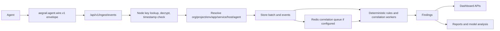

# Hub How It Works

The Hub receives encrypted evidence batches from Agents and turns them into inventory, timeline events, findings, reports, and dashboard data.

## Runtime Flow

## Storage

PostgreSQL stores:

- inventory: organizations, projects, environments, apps, services, hosts, agents
- ingest batches and normalized events
- findings, status history, file ignore rules, browser allowlists
- deployment markers
- model analysis reports and provenance
- dashboard users, sessions, and encrypted TOTP material

Redis is optional but recommended when monitoring many sites. Hub uses it for short-lived ingest-correlation jobs and distributed worker locks. Durable evidence, findings, users, sessions, and reports stay in PostgreSQL.

The Hub process validates required security secrets at startup in `serve` mode.
`AEGRAIL_HUB_WIRE_PRIVATE_KEY` is required before Agent ingest can decrypt
wire envelopes, and `AEGRAIL_HUB_USER_SECRET` is required before dashboard TOTP
material can be used safely.

## Ingest

Agents submit encrypted wire envelopes to `POST /api/v1/ingest/events`.

The Hub:

1. reads the request body with a size limit
2. detects `aegrail.agent.wire.v1`
3. looks up the node by `node_id`
4. derives the shared X25519 key from Hub private key and node public key
5. decrypts AES-GCM ciphertext with schema/node/timestamp as associated data
6. rejects timestamps outside the configured skew window
7. resolves inventory scope from slugs
8. stores the external batch ID idempotently
9. stores normalized events
10. queues correlation work in Redis when configured, or runs correlation inline when Redis is not configured

Wire v1 encrypts the JSON payload and authenticates it through the node key. Raw JSON ingest is rejected. Use HTTPS or a trusted private network outside local development because HTTP metadata, cookies, and operator sessions still need transport protection.

Redis is Hub-internal infrastructure. Agents do not connect to Redis and do not need a Redis proxy. If the Hub is not on the same private network as Agents, put an HTTPS reverse proxy in front of the Hub API and keep Redis private to the Hub service network.

Node provisioning is intentionally more strict than normal read APIs. The Hub
returns a one-time `node_secret` only over HTTPS or loopback requests, because
that value is the Agent private key material for wire v1.

## Rules And Findings

Rules are deterministic and versioned in Hub code. They evaluate event streams and snapshots, then create or refresh findings by dedupe key.

Current platform-aware database rules cover WordPress, PrestaShop, Mautic, Yii2 RBAC, and Laravel. For Mautic, Hub turns user/role access changes, plugin version drift, published integrations with API keys, OAuth client changes, and webhook secret/publish changes into operator-facing findings. For Yii2 RBAC, Hub turns user, role, RBAC, and migration changes into operator-facing findings, with admin-like role changes treated as high risk. For Laravel, Hub turns user, Spatie role/permission, reset-token, session, and migration changes into operator-facing findings, with admin-like role or sensitive permission changes treated as high risk. Mautic plugin/integration/OAuth/webhook count-only snapshot diffs are suppressed when entity-level evidence is available, so the dashboard does not show both a count warning and the real changed object.

Each finding is enriched with `operator_action` metadata. That block explains the primary human action, when it is safe to acknowledge, when to escalate, and which final status to choose after review. Reports and dashboard APIs expose the same guidance instead of leaving warnings as unexplained labels.

Finding status is operator-controlled:

- `open`
- `acknowledged`
- `resolved`
- `false_positive`

The Hub can also accept the current open findings as baseline. Baseline acceptance is a status action for first-scan noise; it does not delete evidence.

## Noise Controls

- File ignore rules suppress future matching file findings for a scoped app/environment.
- Browser script allowlists approve known domains, inline hashes, or tag-manager IDs.
- Deployment markers give expected rollout context to lower-risk drift during a confirmed time window.
- Config coverage records what the Agent says is enabled/disabled, including sanitized ignore paths.

## Model Analysis

Model analysis is optional. The Hub builds a compact evidence bundle from persisted findings, applies redaction and truncation, hashes the prompt/evidence, calls the configured model gateway, and stores the returned structured report.

The dashboard renders controlled Hub-generated HTML from structured report fields. Raw model HTML is not trusted.

When Redis is configured, the automatic model-analysis worker takes a distributed lock before each pass. That lets multiple Hub processes run safely without all of them generating the same reports.

The Hub also exposes a finding-review report. It places the deterministic Hub view beside the latest model-analysis report for the same finding, so an operator can compare rule evidence and model commentary in one view.

Finding-specific model-analysis lists are filtered in PostgreSQL by finding ID
before results reach the HTTP handler. The dashboard should not ask the Hub to
load all model reports and then filter them in memory.

## Operations

`GET /healthz` checks the dependencies available to the running process. It
reports PostgreSQL status, Redis status when Redis is configured, and Ollama
status when a model gateway is available. It returns `503` when a required
dependency is missing or unhealthy.

The HTTP server sets read-header, read, write, and idle timeouts. Background
correlation and model-analysis workers are attached to the process context and
the Hub waits briefly for them during graceful shutdown.

## Notifications

If `AEGRAIL_NOTIFICATION_WEBHOOK_URL` is set, Hub posts signed JSON notifications when findings are observed and when an operator changes finding status. The optional `AEGRAIL_NOTIFICATION_WEBHOOK_SECRET` produces an `X-Aegrail-Signature` HMAC header for receiver verification.
