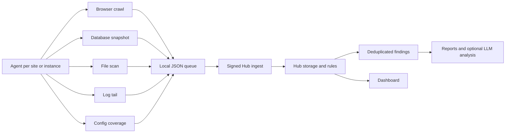

# Project Overview

Aegrail is a monitoring and incident-triage tool for freelancer and small-team operations across WordPress, PrestaShop, and PHP estates.

The product is deliberately not a giant commercial SIEM. It should help an operator see:

- which companies and sites are healthy
- which nodes and agents are reporting
- what changed in files, database state, browser-rendered scripts, logs, and coverage
- which issues need attention
- what can be marked reviewed, fixed, or false positive
- what evidence can be turned into a short report

Detection is deterministic first. LLM analysis is optional and must work from redacted evidence bundles, not replace the rule engine.

## Repository Map

```text
app/        Go module for Hub, Agent, collectors, rules, reports, CLI commands, and storage.
dashboard/  React dashboard for Hub APIs.
services/   Local infrastructure for development.
data/       Local runtime output; keep private and uncommitted.
docs/       Maintained documentation plus brand assets.
```

## Binaries

Aegrail now has separate operational entrypoints:

- `aegrail-hub`: Hub HTTP API, migrations, inventory, findings, rules, reports, browser allowlists, deployments, users, and model-analysis queue work.
- `aegrail-agent`: per-site or per-host agent runtime, config validation, collectors, local queue replay, and model gateway smoke tests.
- `aegrail`: compatibility binary that still exposes both command groups for older scripts.

## Runtime Model



Main responsibilities:

- Agent: a process that runs near a site or hosting account. It loads a YAML config, scans one or more configured sites, writes local queue/state files, replays signed evidence batches to Hub, and reports collector coverage.
- Hub: stores inventory, events, findings, deployment markers, browser allowlists, file ignore rules, reports, users, and rule metadata.
- Dashboard: reads Hub APIs and performs triage actions. It does not run hidden detection logic.
- Reports: export deterministic findings and timelines; optional model reports are stored with prompt and evidence provenance.

## Data Structure

Aegrail uses this hierarchy in the Hub and dashboard:

```text
Company
  Site / Project
    Instance / Node
      Services
        Evidence events
        Findings / issues
```

Definitions:

- Company maps to a Hub organization.
- Site or project maps to a Hub project/app view used by the dashboard.
- Instance or node maps to a host plus an agent identity.
- Service is the observed role, such as `frontend`, `database`, `browser`, `config`, or `agent`.
- Event is a normalized observation: file, log, database, browser, coverage, deployment, or system context.
- Finding is an actionable issue generated by deterministic rules and tied to event IDs.
- Deployment marker is an operator-confirmed timeframe that gives expected rollout context to low/medium drift without hiding high-risk findings.
- Browser script allowlist entry is an operator-approved domain, hash, or tag-manager ID used to reduce repeated script drift noise.

Finding statuses:

- `open`
- `acknowledged`
- `resolved`
- `false_positive`

Status changes keep reason, note, actor, and timestamp. Re-running rules refreshes evidence for the same dedupe key without losing triage state.
