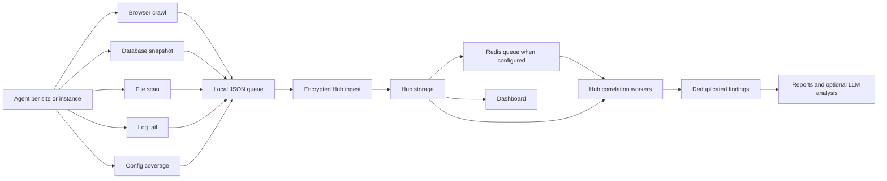

# How Aegrail Works

Aegrail is a monitoring and incident-triage tool for freelancer and small-team operations across WordPress, PrestaShop, Mautic, Yii2 RBAC, Laravel, and PHP estates.

The product is deliberately not a giant commercial SIEM. It should help an operator see:

- which companies and sites are healthy
- which nodes and agents are reporting
- what changed in files, database state, browser-rendered scripts, logs, and coverage
- which issues need attention
- what can be marked reviewed, fixed, or false positive
- what evidence can be turned into a short report

Detection is deterministic first. LLM analysis is optional and must work from redacted evidence bundles, not replace the rule engine.

## Repository Map

```text
hub/        Hub Go module: API, storage, migrations, dashboard serving, reports, users, wire protocol, and rules.
agent/      Agent Go module: site scanning, collectors, local queue/state, and encrypted Hub replay.
dashboard/  React dashboard for Hub APIs.
services/   Local infrastructure for development.
data/       Local runtime output; keep private and uncommitted.
docs/       Maintained documentation plus brand assets.
```

Detailed docs:

- [Agent docs](docs/agent/README.md)
- [Hub docs](docs/hub/README.md)
- [Dashboard docs](docs/dashboard/README.md)
- [Services docs](docs/services/README.md)

## Binaries

Aegrail has separate operational apps:

- `hub/cmd/hub`: Hub HTTP API, migrations, inventory, findings, rules, reports, browser allowlists, deployments, users, and model-analysis queue work.
- `agent/cmd/agent`: per-site or per-host agent runtime, config validation, collectors, local queue replay, and module inspection.

The dashboard is a React frontend served either by Vite during development or by the Hub after `dashboard` is built.

## Runtime Model



Main responsibilities:

- Agent: a process that runs near a site or hosting account. It loads a YAML config, scans one or more configured sites, writes local queue/state files, replays encrypted evidence batches to Hub, and reports collector coverage.
- Hub: stores inventory, events, findings, deployment markers, browser allowlists, file ignore rules, reports, users, and rule metadata. Redis is used only for short-lived Hub queues and locks when configured.
- Dashboard: reads Hub APIs and performs triage actions. It does not run hidden detection logic.
- Reports: export deterministic findings and timelines; optional model reports are stored with prompt and evidence provenance.

## End-To-End Workflow

1. A Hub is installed with PostgreSQL, migrations, a Hub wire private key, and a user secret.
2. One or more Agents are installed near the sites they monitor.
3. Each Agent config declares its identity, runtime queue/state directories, and monitored sites.
4. First run can use `--bootstrap` to capture current state as the initial safe baseline.
5. Normal Agent runs collect file, database, log, browser, and config coverage evidence.
6. Agents queue JSON batches locally, encrypt them with `aegrail.agent.wire.v1`, and send them to the Hub.
7. The Hub decrypts the envelope, stores batches/events, resolves inventory, and queues or evaluates deterministic correlation work.
8. Findings appear in the dashboard with evidence, timeline, related issues, status actions, ignore/allowlist actions, reports, and optional LLM analysis.
9. Operators mark findings acknowledged, resolved, false positive, or accepted as baseline. Those actions keep audit context and do not delete evidence.

## Security Boundary

Agents do not send file contents. They send metadata, hashes, selected database observations, redacted logs, and browser script observations.

Agent-to-Hub wire v1 encrypts the JSON payload with X25519 and AES-256-GCM. Use HTTPS or a trusted private network outside local development because transport metadata and dashboard sessions still need protection.

## Data Structure

Aegrail uses this hierarchy in the Hub and dashboard:

```text
Company
  Site / Project
    Instance / Node
      Services
        Evidence events
        Findings / issues
```

Definitions:

- Company maps to a Hub organization.
- Site or project maps to a Hub project/app view used by the dashboard.
- Instance or node maps to a host plus an agent identity.
- Service is the observed role, such as `frontend`, `database`, `browser`, `config`, or `agent`.
- Event is a normalized observation: file, log, database, browser, coverage, deployment, or system context.
- Finding is an actionable issue generated by deterministic rules and tied to event IDs.
- Deployment marker is an operator-confirmed timeframe that gives expected rollout context to low/medium drift without hiding high-risk findings.
- Browser script allowlist entry is an operator-approved domain, hash, or tag-manager ID used to reduce repeated script drift noise.

Finding statuses:

- `open`
- `acknowledged`
- `resolved`
- `false_positive`

Status changes keep reason, note, actor, and timestamp. Re-running rules refreshes evidence for the same dedupe key without losing triage state.
